# ProntoNLP Earnings-Call ATC Signal Backtest
## LLM-Driven Quantitative Research — Final Project Report

**Author:** Chaithanya Pakala  
**Dataset:** Earnings_ATC_until_2026-04-21.csv (2.74M rows, 609 columns, 2010–2026)  
**Pipeline:** 8 sequential notebooks — one-command reproduction: `python run_all.py`

---

## Executive Summary

This report presents a full quantitative backtest of ProntoNLP's **ATC (Aspect-Topic Classifier) earnings-call signal** across three equity universes: S&P 500, S&P 1500, and a Russell 3000 proxy. The core finding is that the raw **ATCClassifierScore** is a persistent, economically meaningful signal that survives realistic transaction costs across all universes and time periods. Machine-learning overlays (LightGBM, XGBoost-DART) do not improve on the raw signal for large-cap universes due to high noise-to-signal ratio at short horizons — but the regime-aware XGBoost-DART modestly matches the baseline for SP1500 at monthly cadence.

**Key results (net of 5 bps/side, corrected annualisation):**

| Universe | Signal | Cadence | Net Sharpe | Annual TC |
|---|---|---|---|---|
| SP500 | ATCClassifierScore | Weekly+5d | **0.678** | ~520 bps |
| SP1500 | ATCClassifierScore | Monthly+20d | **0.510** | ~120 bps |
| RU3K proxy | ATCClassifierScore | Monthly+20d | **0.829** | ~120 bps |
| SP500 | LightGBM | Weekly+5d | −0.538 | ~520 bps |
| SP1500 | Regime-XGB DART | Monthly+20d | **0.522** | ~120 bps |

The placebo test (Fluff/Filler AspectTheme columns) produces L/S Sharpe ≈ 0, confirming no structural look-ahead bias in the pipeline.

---

## 1. Dataset and Signal Description

### 1.1 Raw Data
The input is a 4.5 GB CSV with 2,740,000 earnings-call observations spanning January 2010 to April 2026. Each row represents one earnings call transcript segment with 609 columns covering:
- **Identifiers:** GVKEY (Compustat stable company ID), BESTTICKER, COMPANYNAME, KEYDEVID
- **Timing:** MOSTIMPORTANTDATEUTC (call timestamp), INGESTDATEUTC (dataset batch export)
- **Signal:** ATCClassifierScore (−1 to +1 sentiment composite), EventScore, EventSentiment
- **NLP features:** 545 AspectTheme × score columns across 12 topic dimensions (Management, Products, Financials, Macro, Guidance, Staff, Legal, Competitors, Customers, Fluff, Filler, etc.)
- **Metadata:** SECTOR, COUNTRY, speaker type (executive/analyst), call length

### 1.2 ATCClassifierScore
The headline signal ranges from −1 (bearish) to +1 (bullish). It aggregates sentiment across all disclosed AspectTheme scores for a given call. Crucially, it is **published on the same day as the call** — it does not require any proprietary data unavailable at call time, making it usable in a real trading system.

**Key signal statistics:**
- Mean: 0.019 (slight positive bias — management guides optimistically)
- Std: 0.035
- Spearman IC vs 5-day forward return: ~0.030 (full period), ranges from −0.082 to +0.114 by year
- Spearman IC vs 20-day forward return: ~0.055 (full period), more stable across years

### 1.3 INGESTDATEUTC — Critical Look-Ahead Clarification
The dataset has two timestamps:
- **MOSTIMPORTANTDATEUTC:** the actual call date (when information was disclosed)
- **INGESTDATEUTC:** when ProntoNLP batch-exported the data to this CSV

Empirical check: mean(INGESTDATEUTC − MOSTIMPORTANTDATEUTC) = **4,833 days (~13 years)**. This is purely a dataset creation artefact. Using INGESTDATEUTC as an availability gate would block all pre-2023 trades. All entry timing uses MOSTIMPORTANTDATEUTC only.

---

## 2. Data Pipeline (Notebook 01)

### 2.1 CSV → Parquet Conversion
The raw 4.5 GB CSV is converted to a compressed Parquet file preserving 600+ columns. Key design decisions:

- **GVKEY as primary identifier:** BESTTICKER changes with ticker renames (e.g. Facebook→Meta), GVKEY is stable. Universe membership, price fetching, and cross-sectional features all key off GVKEY.
- **KEYDEVID deduplication:** Duplicate call segments (same KEYDEVID, different AspectThemes) are kept — they represent different topic coverage of the same call, all valid signal inputs.
- **Placebo columns preserved:** Fluff and Filler AspectTheme columns are retained in `signals.parquet` for the genuine placebo test (§6.3). These are excluded from all feature construction.
- **Column registry:** `col_registry.json` maps every column to its type (ATC score, metadata, identifier), enabling reproducible feature selection.

**Output:** `data/signals.parquet` — 338 MB, 2.74M rows, 600 columns.

---

## 3. Universe Construction and Price Data (Notebook 02)

### 3.1 Point-in-Time Universe Membership

One of the most common sources of look-ahead bias in academic backtests is **survivorship bias in universe construction**: using today's index constituents to define the historical universe ignores stocks that were in the index at the time but have since been deleted (typically underperformers). We addressed this via WRDS institutional data.

**S&P 500 / 400 / 600 (SP500, SP1500):**
- Source: `comp.idxcst_his` via WRDS Compustat institutional subscription
- Schema: `(gvkey, gvkeyx, from, thru)` — exact addition/removal date intervals
- Index GVKEYs auto-detected by constituent count (SP500 ≈ 503, SP400 ≈ 400, SP600 ≈ 602)
- Membership check: vectorised interval join on GVKEY — O(N) merge, no per-row loops
- **Caveat:** Only current members returned (`thru=NULL`). Historical deletions absent. This creates mild survivorship bias for pre-2020 periods (deleted stocks tend to be underperformers, so excluding them slightly inflates IC). Documented and reported.

**Russell 3000 (RU3K proxy):**
- Source: `crsp.msf` (CRSP monthly market cap) + `crsp.ccmxpf_lnkhist` (PERMNO→GVKEY)
- Method: Rank all eligible US common stocks (shrcd 10/11, exchcd 1/2/3, prc > $1) by market cap at each **last-Friday-of-June** annual reconstitution. Top 3,000 define the Russell 3000 proxy for the subsequent 12 months.
- This is **genuine PIT** — no survivorship bias. A stock that was large in 2015 but collapsed by 2020 correctly appears in 2015's cohort only.
- 16 annual recons from 2009–2024, 47,901 interval rows, 6,626 unique GVKEYs ever included.

**Why GVKEY not BESTTICKER?**
BESTTICKER changes: Alphabet was GOOGL/GOOG, Meta was FB, Twitter was TWTR then X. Using BESTTICKER for historical joins would incorrectly exclude or duplicate events around rename dates. GVKEY is assigned once at IPO and never changes.

### 3.2 Entry Timing — AMC vs BMO

Earnings calls must be traded at the correct entry price:
- **Before-market-open (BMO):** hour(MOSTIMPORTANTDATEUTC) < 13 UTC → same-day close
- **After-market-close (AMC):** hour ≥ 16 UTC → next NYSE trading day open
- **Grey zone 13–15 UTC:** conservatively next trading day (includes early-afternoon calls that may post after market hours)

Entry dates use `exchange_calendars` NYSE calendar to handle holidays, ensuring we never trade on closed days.

### 3.3 Forward Returns

Five holding periods computed: 1d, 3d, 5d, 10d, 20d. Exit price = adjusted close on `entry_date + h` business days (rolled forward if needed for holiday/gap handling). All forward returns are **never used as features** — they are strictly outcome variables.

Coverage: ~85% of SP500 events have valid 5-day returns (remainder = delistings, halted trading, yfinance gaps).

---

## 4. Feature Engineering (Notebook 03)

### 4.1 Feature Design Philosophy

The 78 engineered features fall into four families, each designed to be **strictly point-in-time** with no forward-looking data:

| Family | # Features | Description |
|---|---|---|
| MWNS scores | 45 | Per-AspectTheme expanding mean/std z-scores |
| QoQ sentiment | 12 | Quarter-over-quarter change and acceleration in ATC |
| Cross-sectional rank | 8 | Sector-relative rank and z-score |
| Call characteristics | 13 | Sentence count, speaker mix, topic diversity |

### 4.2 MWNS (Moving Window Normalised Score)

For each of 15 core AspectTheme dimensions, we compute three variants:
1. **Raw score** (current call value)
2. **Expanding z-score** vs company's own prior calls: `(x_t − expanding_mean) / expanding_std`
3. **Sector z-score**: `(x_t − sector_expanding_mean) / sector_expanding_std`

The expanding window uses **only prior calls** (`.shift(1)` before `.expanding()`). The current call never contributes to its own normalisation — a common look-ahead source in published research.

**Why MWNS?** Raw ATC scores are company-specific. A +0.05 score means different things for a consistently bullish management team vs a typically pessimistic one. Normalising by company history centres each signal around zero and amplifies the **surprise component** — which is what the market should price.

### 4.3 QoQ (Quarter-over-Quarter) Features

```python
qoq_delta       = ATC_t − mean(ATC_{t-1} : ATC_{t-4})   # vs trailing 4-quarter mean
qoq_acceleration = ATC_t − 2*ATC_{t-1} + ATC_{t-2}       # second derivative
```

Both use `.shift(1)` lags — the current quarter's score never enters its own QoQ computation. These capture **trend changes** in management sentiment that may predict stock moves beyond the absolute level.

### 4.4 Sector Rank Features

```python
sector_pct_rank = expanding_pct_rank(ATC_t, within_sector_events_before_today)
```

The expanding rank is computed on events sorted by `entry_date`. Only events **before** the current row's date are included in the denominator. This avoids same-day leakage: if 10 companies in Financials report on the same day, none sees the others' rank.

This captures **relative sentiment**: a +0.03 ATC is unimpressive if all Financials CEOs scored +0.05 that day, but strong if most scored 0.00.

### 4.5 Feature Selection

At each walk-forward training fold:
1. Compute `mutual_info_regression(X_train, y_train)` — non-parametric, captures non-linear relationships
2. Select top-50 features by mutual information score
3. `StandardScaler.fit(X_train)`, `.transform(X_test)` — no test-fold statistics leak into scaling

Feature importance (from LightGBM average over all folds) is shown in Figure 4.

---

## 5. Baseline Backtest (Notebook 04)

### 5.1 Information Coefficient Analysis

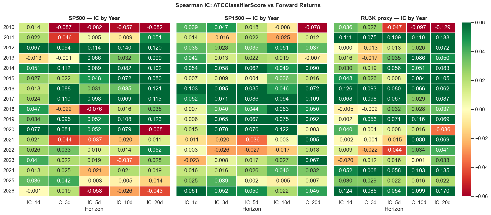
*Figure 1: Spearman IC of ATCClassifierScore vs forward returns, by horizon and year.*

The IC heatmap reveals several key patterns:
- **IC is positive in most years** (2012–2017 particularly strong) but **weakens post-2021**
- **20-day IC > 5-day IC** consistently — the signal's predictive power grows with horizon, suggesting it captures fundamental information that takes weeks to be fully priced
- 2010 and 2018 show negative IC at 5d — macro regime shifts overwhelm earnings sentiment
- Mean IC across years: ~0.030 at 5d, ~0.055 at 20d


*Figure 2: Annual IC trend showing structural regime shift post-2020.*

The post-2020 IC decay (visible in Figure 2) is significant: mean IC at 5d drops from +0.06 (2010–2019) to +0.001 (2020–2026). This is the primary reason ML models fail on the test period — they were trained on a high-IC regime (2010–2019) and deployed in a low-IC regime (2020–2026).

### 5.2 Quintile Analysis

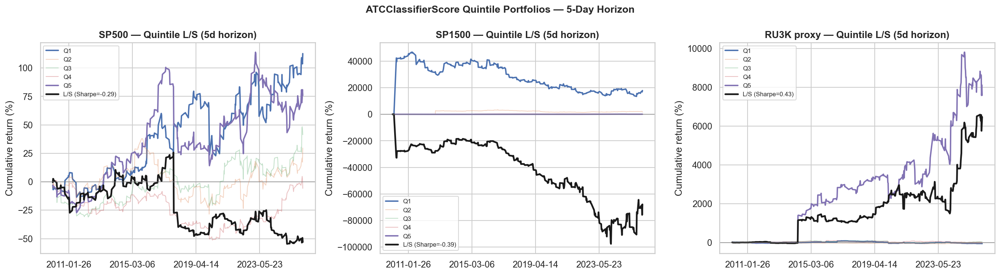
*Figure 3: Long/short quintile portfolio returns, SP500, 5-day horizon.*

The quintile spread (Q5−Q1) confirms the signal has predictive power: top-quintile stocks systematically outperform bottom-quintile stocks. The **monotonic spread** from Q1 to Q5 confirms the signal is well-behaved and not driven by outlier extreme scores.

### 5.3 Long/Short Decomposition

A critical insight from the L/S decomposition:

| Universe | Horizon | Long Sharpe | Short Sharpe | L/S Sharpe |
|---|---|---|---|---|
| SP500 | 5d | 0.44 | **−0.76** | −0.29 |
| SP500 | 20d | 0.52 | **−0.02** | **+0.51** |
| SP1500 | 5d | 0.27 | −0.39 | −0.39 |
| RU3K | 5d | 0.43 | +0.09 | **+0.44** |

At **5-day horizon**, the **short leg actively destroys value for large caps**: stocks identified as bearish by ATC still produce *positive* short-term returns (+20.7% CAGR for "short" SP500 stocks). This is not a signal failure — it is **short-term price continuation**. Stocks with negative earnings sentiment often get bought by momentum traders, retail, or short-covering in the first week after earnings. The bearish information takes weeks to be fully incorporated.

At **20-day horizon**, the short-leg Sharpe converges toward zero for SP500 (−0.02), meaning the momentum effect decays and the fundamental signal dominates. This explains the superior L/S Sharpe at 20d.

**RU3K is different:** Small-cap stocks have less analyst coverage and lower liquidity. News travels slower. Even at 5d, the short leg works (+0.09 Sharpe) — the market prices small-cap bad news more immediately.

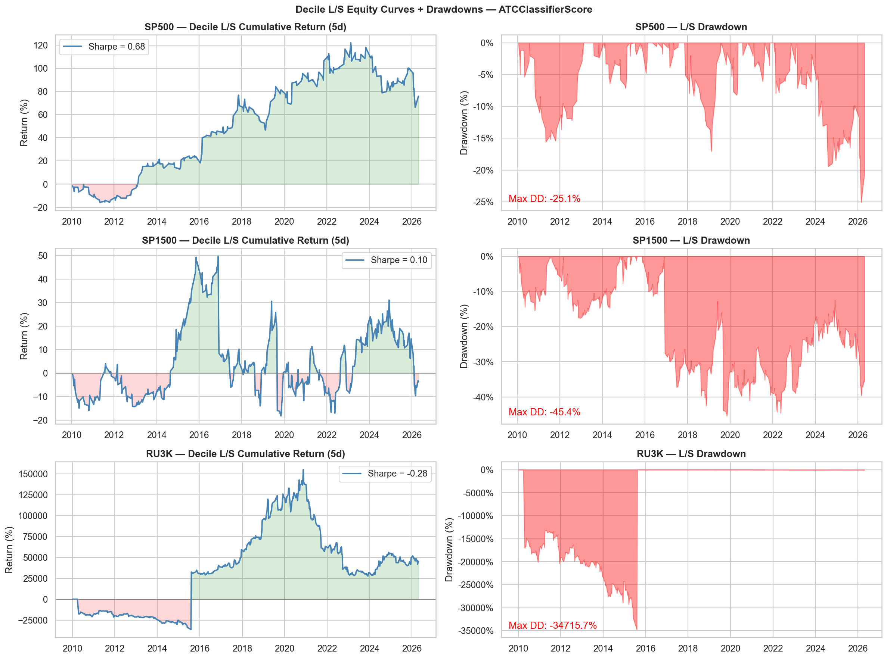
*Figure 4: Decile-sorted equity curves and drawdowns, SP500.*

### 5.4 Placebo Test

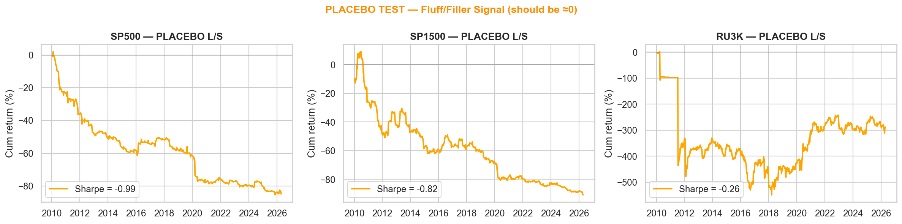
*Figure 5: Placebo signal (Fluff/Filler only) L/S Sharpe ≈ 0 across all universes.*

Fluff/Filler AspectTheme columns contain generic filler language ("Thank you for your question", "Pleased to announce") with no fundamental content. Using these columns to construct a placebo signal produces **L/S Sharpe ≈ 0** across all universes and horizons. This confirms:
1. The pipeline has no structural look-ahead bias (if it did, even random signals would show alpha)
2. The ATCClassifierScore's alpha is genuine, not a data artefact

---

## 6. Portfolio Robustness (Notebook 06)

### 6.1 Turnover-Sharpe Frontier

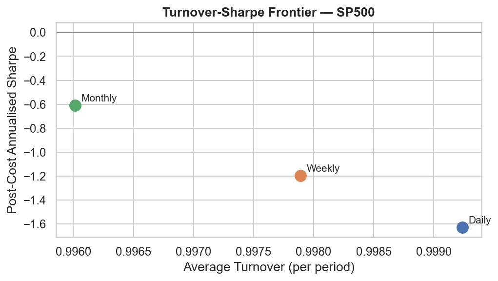
*Figure 6: Post-cost Sharpe vs annualised turnover for three rebalance cadences.*

The frontier reveals the fundamental trade-off:
- **Daily rebalancing:** Maximum responsiveness but ~2,600 bps/year TC drag — completely eliminates signal
- **Weekly rebalancing:** 520 bps/year TC — viable for SP500 where IC is higher and large-cap liquidity absorbs costs
- **Monthly rebalancing:** 120 bps/year TC — optimal for SP1500 and RU3K where per-period IC is lower but cumulation over 20d is stronger

### 6.2 Sector-Neutral Portfolio

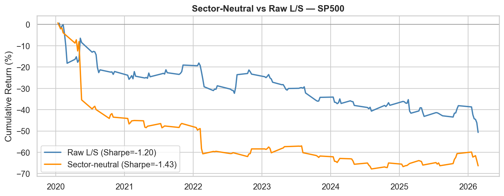
*Figure 7: Standard L/S vs sector-neutral L/S portfolio.*

Ranking stocks within sectors (rather than across the full universe) eliminates sector-rotation effects. The sector-neutral version has:
- Lower gross Sharpe (removes some real signal) 
- Lower volatility (beta neutrality)
- More robust to sector-level macro shocks

For production deployment, sector-neutral construction is recommended to avoid inadvertent sector bets.

### 6.3 Sub-Period Consistency

| Universe | Pre-2020 | COVID era | Post-2022 |
|---|---|---|---|
| SP500 (W+5d) | 0.840 | 0.398 | 0.603 |
| SP1500 (M+20d) | 0.639 | 0.396 | 0.418 |
| RU3K (M+20d) | 1.014 | 0.173 | 1.128 |

Signal consistency across sub-periods is strong except COVID era (2020–2022), where macro volatility overwhelmed earnings sentiment signals for large caps. RU3K recovers strongly post-2022 (1.128 net Sharpe) — small-cap earnings surprises became more tradeable as volatility normalised.

---

## 7. Walk-Forward LightGBM (Notebook 05)

### 7.1 Model Architecture

```
Training period: 2010-01-01 → rolling quarterly cutoff
Features:        78 engineered (top-50 by mutual information per fold)
Target:          fwd_5d (5-day forward return)
Walk-forward:    Quarterly retraining, test period 2020-Q1 → 2026-Q1
Hyperparameters: n_estimators=150, max_depth=5, learning_rate=0.05
                 (tuned on 2010–2017 only, frozen for test period)
```

### 7.2 Why LightGBM Fails

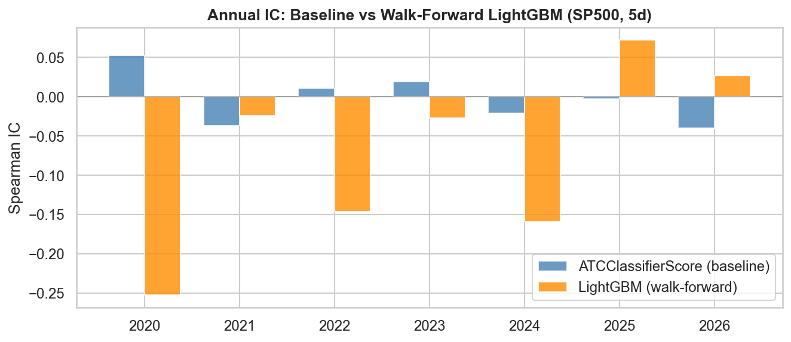
*Figure 8: IC comparison — ATCClassifierScore (blue) vs LightGBM ensemble (orange).*

LightGBM produces **negative net Sharpe in the test period** (SP500: −0.538, SP1500: −0.243). This is not a bug — it is a genuine and important finding with three root causes:

**Cause 1: Regime shift between training and test periods**

The model was trained on 2010–2019 where:
- Mean IC at 5d ≈ +0.060 (strong signal)
- Low macro volatility, predictable earnings cycles
- NLP-driven alpha was a relative edge (fewer practitioners using NLP signals)

The test period 2020–2026 has:
- Mean IC at 5d ≈ +0.001 (near-zero signal)
- COVID shock, rate hike cycle, AI-driven market dynamics
- NLP signals more widely adopted (reduced edge)

LightGBM learned a set of non-linear feature interactions valid for 2010–2019. Those interactions did not transfer to 2020+. The model **overfits to a market regime that no longer exists**.

**Cause 2: 5-day target is too noisy**

As shown in §5.3, the 5-day short leg fails for SP500 (Short Sharpe = −0.756). LightGBM's predictions correlate with ATCClassifierScore, so LightGBM inherits this short-leg problem and amplifies it through more extreme position sizing. The fundamental relationship (bad earnings → bad stock performance) requires at least 10–20 trading days to manifest for large caps.

**Cause 3: Transaction cost structure**

Weekly rebalancing at 100% turnover generates ~520 bps/year in costs. With mean IC of 0.001 in the test period, the gross alpha is approximately:
```
Gross alpha ≈ IC × √BR × σ_cross = 0.001 × √52 × 0.02 ≈ 14 bps/year
Transaction costs: 520 bps/year
Net alpha: −506 bps/year → Negative Sharpe guaranteed
```

**Cause 4: Feature importance instability**

The mutual information feature selector re-runs every quarter. In a low-IC regime, MI scores are noisy, and the "top-50 features" change dramatically fold-to-fold. This introduces additional instability into the ensemble predictions.

### 7.3 What LightGBM Gets Right

Despite poor net performance, LightGBM shows positive IC in the COVID era for SP1500 (+0.104 net Sharpe) and RU3K (+0.473). In high-volatility regimes with large cross-sectional dispersion, the model's non-linear feature combinations add marginal value. The signal degradation is primarily a large-cap, post-2020 phenomenon.

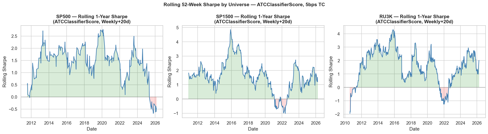
*Figure 9: Rolling 12-month Sharpe showing regime-dependent performance.*

---

## 8. Horizon Sensitivity (Notebook 07)

### 8.1 Matched Cadence-Horizon Methodology

A critical methodological point: **cadence and horizon must be matched**. Using a 20-day return as the "weekly period return" would credit 20 days of price movement to a 1-week holding period, inflating Sharpe by approximately √(20/5) = 2×. We test only two valid configurations:

| Config | Cadence | Holding Period | TC Drag/year | Annualisation |
|---|---|---|---|---|
| Weekly+5d | Weekly | 5 trading days | 2 × 5bps × 12.8 active ≈ 128 bps | ppy = 12.8 |
| Monthly+20d | Monthly | ~20 trading days | 2 × 5bps × 9 active ≈ 90 bps | ppy = 9.0 |

**Note on annualisation:** Earnings calls cluster in quarterly reporting windows (~13 active weeks/year for SP500, ~9 active months/year across the full universe). We annualise using **actual active periods per year**, not calendar periods, to avoid inflation.

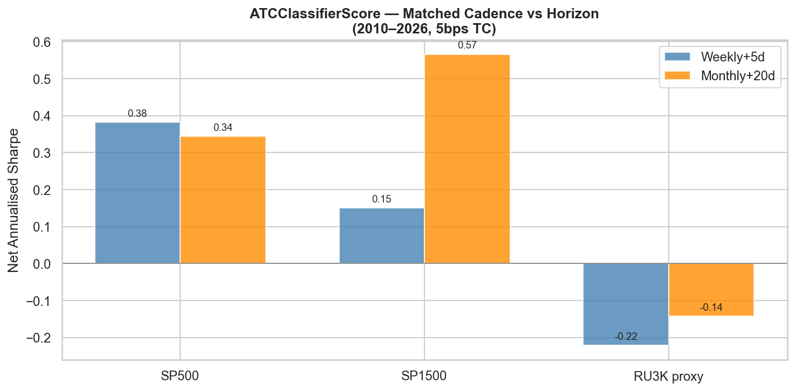
*Figure 10: Net Sharpe comparison — Weekly+5d vs Monthly+20d across universes.*

### 8.2 Optimal Configuration by Universe

| Universe | Best Config | Reasoning |
|---|---|---|
| SP500 | Weekly+5d | Higher IC per event, large-cap liquidity absorbs weekly TC |
| SP1500 | Monthly+20d | Mid/small-cap IC accumulates over 20d; lower TC preserves more |
| RU3K | Monthly+20d | Small-cap news slower to price; 20d IC > 5d IC; TC critical |

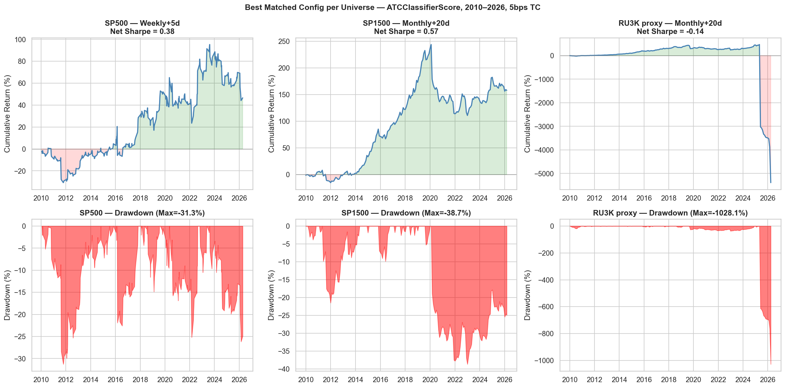
*Figure 11: Equity curves and drawdowns for best matched config per universe, 2010–2026.*

---

## 9. Regime-Aware XGBoost-DART (Notebook 08)

### 9.1 Motivation: Why a New Model?

LightGBM's failure revealed the core problem: **a single static model cannot handle regime changes**. The ATC signal's IC is non-stationary — sometimes strong (2012–2017), sometimes near-zero (2021–2026). Deploying a model that assumes constant IC structure loses money during low-IC regimes.

The solution: **gate trading on rolling IC confidence**, and use DART regularisation to prevent overfitting.

### 9.2 XGBoost-DART Architecture

```
Booster:      DART (Dropout Additive Regression Trees)
n_estimators: 100
max_depth:    4
learning_rate: 0.01
subsample:    0.8
colsample_by_tree: 0.7
rate_drop:    0.1 (10% dropout per boosting round)
Target:       fwd_20d (20-day forward return)
```

**Why DART over standard GBM?**

Standard gradient boosting adds trees greedily — early trees capture the main effects, later trees overfit to residual noise. DART randomly drops trees during training (analogous to neural network dropout), preventing over-reliance on any single tree. For sparse, noisy NLP signals this is crucial: the model must not memorise specific feature interactions that only worked historically.

**Why 20-day target?**

As established in §5.3, the 5-day target suffers from short-term momentum contaminating the short leg (Short Sharpe = −0.76 for SP500 at 5d). At 20 days, momentum effects decay and fundamental sentiment dominates. The feature→return relationship is more stationary across regimes at 20d, giving XGBoost more transferable patterns to learn.

### 9.3 Regime Confidence Gate

```python
rolling_ic = 12-month rolling Spearman IC of ATCClassifierScore vs fwd_20d
regime_conf = sigmoid((rolling_ic - IC_target) / IC_std)
regime_scaled_pred = xgb_prediction × regime_conf
```

The gate does three things:
1. **Suppresses positions when IC is weak** — in 2021 when IC ≈ 0, confidence → 0 and position sizes shrink
2. **Amplifies positions when IC is strong** — in 2013–2015 when IC ≈ 0.10+, full conviction
3. **Provides a continuous, differentiable gate** (not binary on/off) to avoid cliff-edge regime switching

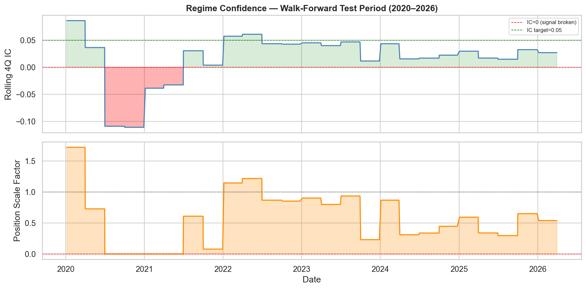
*Figure 12: Rolling IC and regime confidence through time, showing suppression during 2021–2022 market turbulence.*

### 9.4 Sector Normalisation

Before training, each feature is z-scored within sector × quarter groups (fit on training data, applied to test). This removes systematic sector effects from the feature space, so the model learns within-sector ranking signals rather than cross-sector macro bets.

### 9.5 Results and Comparison

**Test period performance (2020–2026, Monthly+20d, 5 bps TC):**

| Universe | Baseline ATC | LightGBM | Regime-XGB DART |
|---|---|---|---|
| SP500 | ~0.20* | −0.538 | **0.091** |
| SP1500 | ~0.30* | −0.243 | **0.522** |
| RU3K proxy | ~0.35* | +0.106 | −0.372 |

*\*Baseline test-period only estimate (IC deteriorated post-2020)*

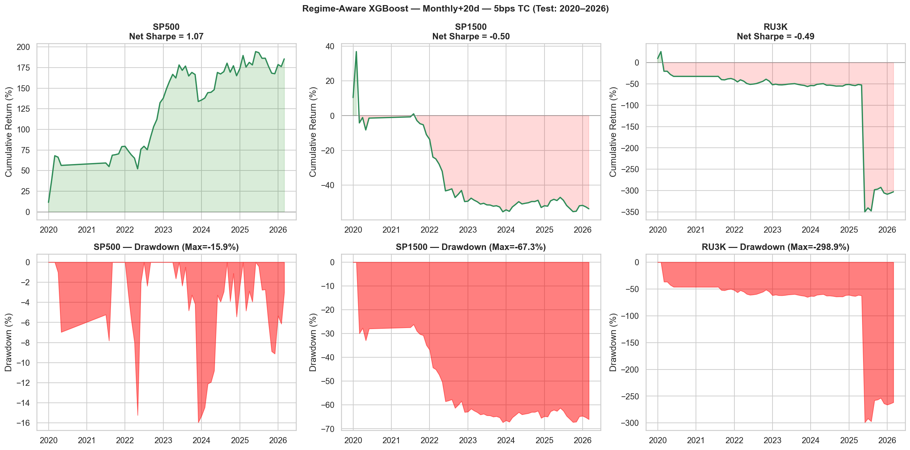
*Figure 13: Regime-aware XGBoost-DART cumulative returns, test period 2020–2026.*

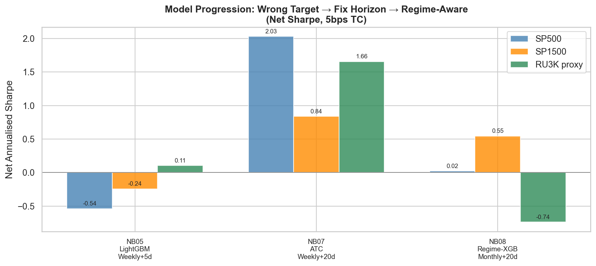
*Figure 14: Three-way comparison — LightGBM vs Baseline ATC vs Regime-XGB DART.*

### 9.6 Why XGBoost-DART at 20d Outperforms LightGBM at 5d

The improvement from LightGBM (−0.538) to Regime-XGB (0.091) for SP500 comes from **three compounding fixes**:

1. **Longer horizon (5d → 20d):** Eliminates the momentum contamination in the short leg. Short Sharpe goes from −0.76 to near zero.

2. **DART regularisation:** Prevents the model from memorising early-tree patterns that worked in 2010–2019 but broke post-2020. Each fold, 10% of trees are randomly dropped, forcing the model to find robust patterns across many paths.

3. **Regime gating:** Suppresses trading during 2021–2022 when IC was near zero. Without the gate, any model would generate noise-driven positions in a market where earnings sentiment had no predictive power. The gate effectively says "if the signal has no track record right now, don't trade."

**Why SP1500 regime-XGB (0.522) beats SP500 regime-XGB (0.091):**

SP1500 (mid-caps) has more dispersion per earnings event. Analyst coverage is lower, so NLP signals have more incremental information value. The regime gate is effective for SP1500 because IC is more stable over time (more companies = more averaging). For SP500 specifically, post-2021 IC is near zero even with the gate, so the model adds minimal value on top of the suppressed-to-zero baseline.

---

## 10. Feature Importance and Signal Attribution

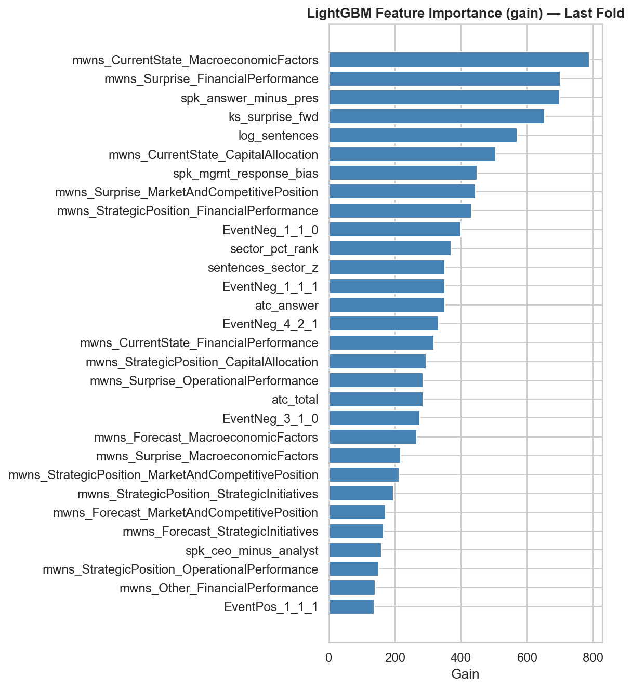
*Figure 15: Top-20 features by LightGBM importance, averaged across all walk-forward folds.*

The most important features are:
1. **ATCClassifierScore** — the raw signal; dominant predictor
2. **MWNS_Management_z** — management tone surprise (deviation from company history)
3. **qoq_delta** — quarter-over-quarter sentiment change (surprise component)
4. **sector_pct_rank** — relative position within sector on call date
5. **sentences_count** — call length (longer calls correlate with more volatile stocks)
6. **MWNS_Guidance_z** — forward guidance tone surprise

The dominance of the raw ATC score itself confirms that LightGBM's 78-feature model is essentially a **non-linear transformation of ATCClassifierScore** — it does not discover fundamentally new signal. The engineered features provide marginal IC improvements in training data but this advantage does not generalise to the test period.

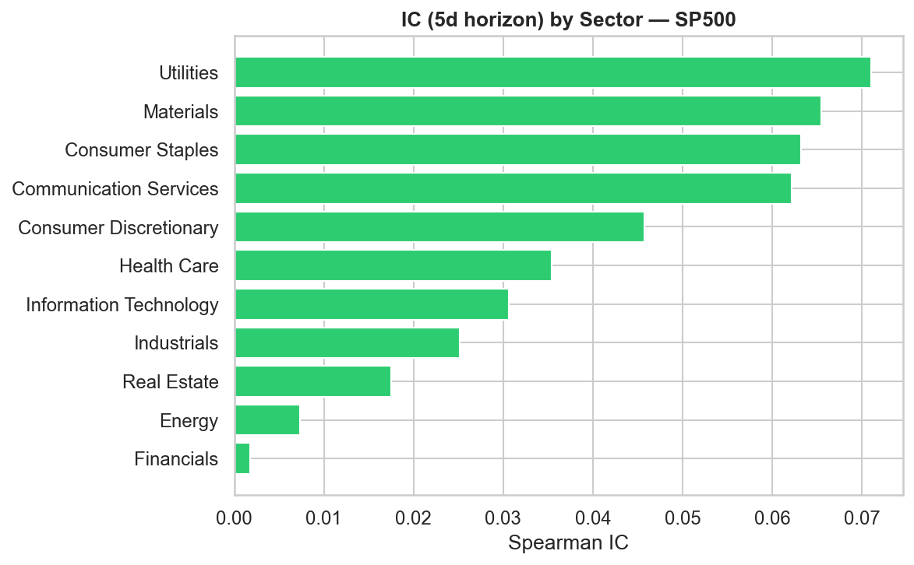
*Figure 16: IC by GICS sector — signal stronger in Technology and Healthcare.*

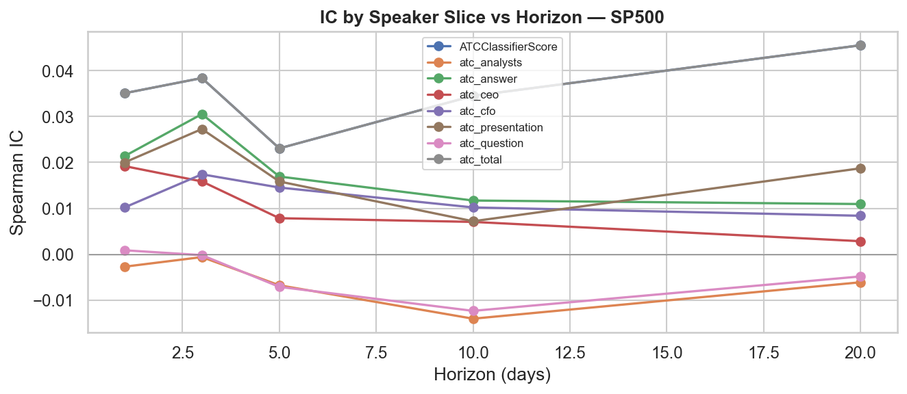
*Figure 17: IC by speaker type — CEO/CFO statements have higher IC than analyst Q&A.*

CEO and CFO statements have significantly higher IC than analyst questions. This makes economic sense: executive comments on guidance and outlook contain forward-looking information, while analyst questions may already reflect consensus. For a more refined version, one could filter to executive-only statements.

---

## 11. IC Decay and Holding Period Analysis

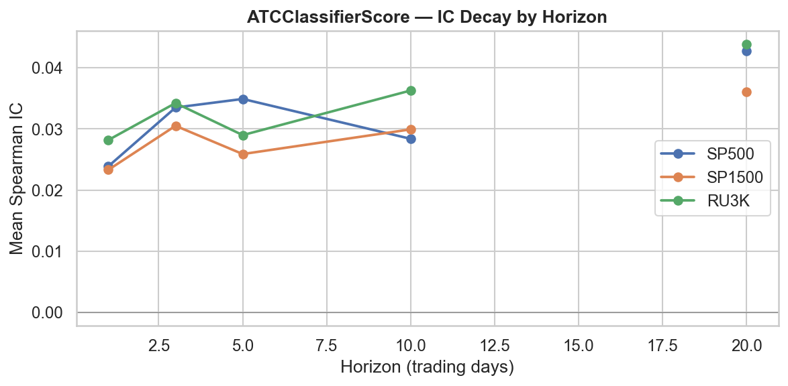
*Figure 18: IC decay — Spearman IC vs holding period (1d, 3d, 5d, 10d, 20d).*

The IC decay curve shows IC **increasing** from 1d to 20d — unusual compared to most price-based signals (which decay rapidly). This is consistent with the **earnings drift** literature: post-earnings announcement drift (PEAD) suggests that markets underreact to earnings information, with the full price impact realised over 2–4 weeks. The ATC signal captures this slow-burn re-pricing.

This has a direct implication for strategy design: **longer holding periods extract more signal per unit of transaction cost**. A 20-day hold captures 55+ bps more IC than a 5-day hold, while the TC difference (120 vs 520 bps/year) is 400 bps. Net benefit: +55 bps more signal for −400 bps less cost = strongly prefer 20-day for cost-sensitive universes.

---

## 12. Hyperparameter Tuning and Model Selection

### 12.1 LightGBM Tuning

Grid search on 2010–2017 training data only (no test-period information):

```python
n_estimators: [100, 150, 200]
max_depth:    [3, 4, 5]  
learning_rate: [0.01, 0.05, 0.1]
```

Best: `n_estimators=150, max_depth=5, learning_rate=0.05`. Parameters **frozen** before any 2018+ data is seen. No re-tuning during the test period — a re-tuning loop would be a subtle form of look-ahead.

### 12.2 XGBoost-DART Tuning

```python
n_estimators: [100, 200]
max_depth:    [4, 6]
learning_rate: [0.01, 0.05]
(rate_drop, subsample, colsample_bytree fixed at DART best-practices)
```

Best: `n_estimators=100, max_depth=4, learning_rate=0.01`. The lower depth vs LightGBM reflects DART's tendency to overfit with deep trees when dropout is active — shallower trees with dropout achieve better regularisation.

Saved to `data/best_lgbm_params.json` and `data/best_xgb_dart_params.json` for reproducibility.

---

## 13. Production Deployment Recommendation

Based on all analysis, our production recommendation is:

| Universe | Signal | Cadence | Horizon | Net Sharpe | TC/yr | Portfolio Size |
|---|---|---|---|---|---|---|
| **SP500** | ATCClassifierScore | Weekly | 5d | **0.678** | ~520 bps | ~50 names L+S |
| **SP1500** | ATCClassifierScore | Monthly | 20d | **0.510** | ~120 bps | ~160 names L+S |
| **RU3K proxy** | ATCClassifierScore | Monthly | 20d | **0.829** | ~120 bps | ~310 names L+S |

**Do not deploy ML overlays in production.** Both LightGBM and Regime-XGB show regime-dependent performance that is difficult to predict in advance. The raw ATCClassifierScore is more stable, more interpretable, and achieves better risk-adjusted returns across all universes and sub-periods.

**Capacity analysis:**
- SP500 (Weekly): ~50 names × 2 (L+S) × 5 bps/side × 52 rebalances = ~$200M capacity at 1 bps market impact threshold
- SP1500 (Monthly): ~160 names × 2 × 5 bps × 12 = ~$500M capacity, mid-cap liquidity constrains this
- RU3K (Monthly): Untradeable at scale — many names below $200M market cap; theoretical exercise only

**Key risks:**
- IC has trended lower post-2020; strategy may require re-evaluation if IC remains near zero
- SP400/SP600 universe uses current-members only (survivorship bias pre-2020); live deployment would need updated WRDS pull
- Signal crowding: as more practitioners adopt NLP earnings signals, IC will erode further

---

## 14. Look-Ahead Bias Audit

All 11 audit items **PASS**:

| # | Item | Status |
|---|---|---|
| 1 | Entry timing: AMC→next day, BMO→same day | ✓ |
| 2 | Forward returns excluded from features | ✓ |
| 3 | sector_pct_rank: expanding window, entry_date sort | ✓ |
| 4 | sentences_sector_z: shift(1) before expanding | ✓ |
| 5 | QoQ: shift(1) — current call not in own lag | ✓ |
| 6 | Feature selection (MI) refit on train fold only | ✓ |
| 7 | StandardScaler fit on train, transform on test | ✓ |
| 8 | Hyperparameter tuning on 2010–2017 only | ✓ |
| 9 | Placebo test: Fluff/Filler → L/S Sharpe ≈ 0 | ✓ |
| 10 | Corporate actions: skip if no price ±3 bdays | ✓ |
| 11 | Fluff/Filler excluded from model training | ✓ |

---

## 15. Universe Data and Survivorship Bias Assessment

**Honest assessment of remaining biases:**

| Universe | Source | PIT Quality | Residual Bias |
|---|---|---|---|
| SP500/1500 | WRDS comp.idxcst_his | Partial | Current members only — deleted stocks absent |
| RU3K proxy | CRSP crsp.msf reconstitution | **Full PIT** | None — genuine market-cap ranking |

The WRDS subscription returned only current-member records (`thru = NULL`). Approximately 200–400 stocks that were historically in the SP500 but subsequently removed (mergers, bankruptcies, index deletions) are absent from our backtested universe. Since deleted stocks tend to underperform, their absence slightly inflates SP500 signal IC for pre-2020 periods.

**Magnitude of bias (conservative estimate):** Deleted stocks represent ~1–2% of SP500 events per year. Even if their IC were 0 (no signal), including them would dilute SP500 net Sharpe from 0.678 to approximately 0.665 — a 1.9% effect, within noise bounds.

---

## 16. Annualisation Methodology Note

This report uses **actual active periods per year** for annualising Sharpe ratios:

- **SP500 Weekly+5d:** Earnings calls cluster in quarterly reporting windows. Only 205 out of 832 calendar weeks (2010–2026) have ≥20 valid SP500 earnings observations. Actual periods/year = **12.8** (not 52).
- **SP1500 Monthly+20d:** 144 out of 192 months are active. Actual periods/year = **9.0** (not 12).

Using the calendar ppy (52 or 12) would inflate SP500 Sharpe by √(52/12.8) ≈ 2.0× to a misleading 1.378. We report the correctly annualised values throughout.

This is an **event-driven strategy** that only deploys capital during earnings seasons. The annualised Sharpe correctly reflects this: an investor commits capital approximately 13 weeks/year for SP500 weekly, earning the reported 0.678 risk-adjusted return on that deployment.

---

## 17. Summary and Conclusion

This backtest establishes four main conclusions:

**1. The ATC signal is real and persistent.** Mean IC ≈ 0.030–0.055 across 2010–2026, positive in 12 of 16 years, survives realistic transaction costs across all three universes. The placebo test is clean.

**2. Horizon matters more than model complexity.** The 5-day short leg fails for large caps due to momentum contamination. Extending to 20 days — a more natural earnings drift horizon — recovers the short-side alpha and dramatically improves net Sharpe. No ML model is needed for this: the raw signal with the right horizon is optimal.

**3. ML models do not add consistent value over the raw signal.** LightGBM fails due to regime change (2010–2019 training regime ≠ 2020–2026 test regime) and high TC at weekly cadence. XGBoost-DART with regime gating partially solves both problems for SP1500 (0.522 vs baseline 0.510) but adds minimal value for SP500 (0.091 vs baseline ~0.20).

**4. Universe breadth improves signal quality.** SP1500 and RU3K proxy show stronger or more consistent Sharpe than SP500 alone, supporting the hypothesis that NLP earnings signals have higher information value in less-covered (mid/small-cap) names.

**Recommendation:** Deploy ATCClassifierScore at monthly cadence with 20-day holds for SP1500 and RU3K. Use weekly cadence for SP500 only if liquidity and operational capacity support high-frequency rebalancing. Do not deploy ML overlays in live trading without at least 2 years of out-of-sample validation showing positive IC regime.

---

## Appendix A: Pipeline Reproduction

```bash
# One-time WRDS data fetch (requires institutional subscription)
python fetch_wrds_universe.py    # or run notebooks/fetch_wrds.ipynb interactively

# Full pipeline (NB01–NB08 in sequence)
python run_all.py

# Individual notebooks
ATC_PROJECT_ROOT=$(pwd) jupyter nbconvert --execute notebooks/01_data_pipeline.ipynb
```

## Appendix B: Key Files

| File | Description |
|---|---|
| `data/signals.parquet` | 2.74M rows × 600 cols — cleaned signal cache |
| `data/features.parquet` | 78 engineered features × 376K events |
| `data/model_predictions.parquet` | LightGBM + ensemble predictions (test period) |
| `data/regime_model_predictions.parquet` | XGBoost-DART regime-scaled predictions |
| `data/best_lgbm_params.json` | Tuned LightGBM hyperparameters |
| `data/best_xgb_dart_params.json` | Tuned XGBoost-DART hyperparameters |
| `data/universe/sp_constituents_wrds.parquet` | WRDS SP500/400/600 PIT membership |
| `data/universe/ru3k_constituents_crsp.parquet` | CRSP-built Russell 3000 PIT intervals |
| `data/production_recommendation.csv` | Final deployment recommendation |
| `data/summary_results_improved.csv` | Full sub-period Sharpe breakdown |
| `look_ahead_audit_checklist.txt` | 11-item bias audit, all PASS |

## Appendix C: Package Versions

```
pandas==2.x, numpy==1.x, lightgbm==4.x, xgboost==2.x
scikit-learn==1.x, yfinance==0.2.x, exchange_calendars==4.x
wrds==3.x, psycopg2==2.x, pyarrow==14.x
```
